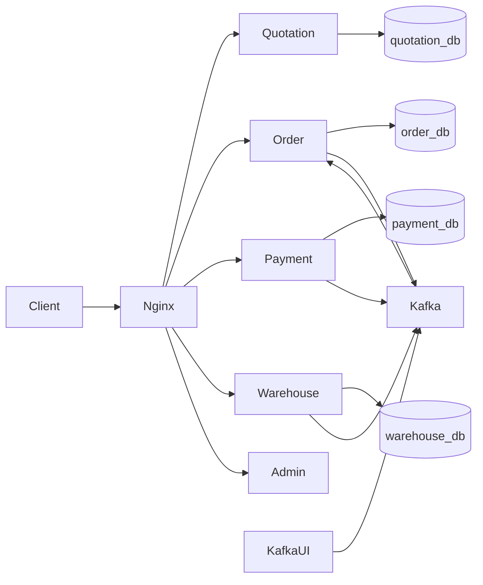
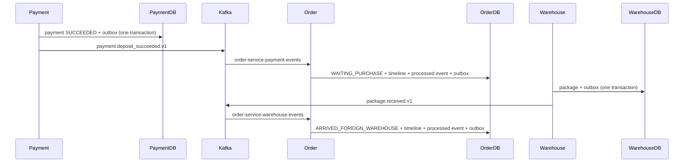

# Architecture

## System context

The broader domain includes Customer, Purchaser, Warehouse Staff, and Admin actors, plus external payment, exchange-rate, and domestic-delivery providers. Only the demo subset is implemented: customer-style quotation/order/payment calls, warehouse package receipt, and read-only Admin rates. All external providers are mocks or future-state boundaries.

## Container-level architecture



Nginx exposes only the public REST API. Five Go containers, PostgreSQL, Kafka, Kafka UI, and the one-shot topic initializer share a private Compose network.

## Service responsibilities

- Quotation owns product validation, mock exchange rates, fee calculation, and quotations.
- Order owns Order state, items, tracking timeline, idempotent consumers, and Order outbox events.
- Payment owns deposit payments and their success outbox event.
- Warehouse owns foreign-warehouse packages and their receipt outbox event.
- Admin exposes a validated, immutable configuration snapshot and has no runtime database/Kafka dependency.

## Synchronous communication

```text
Order -> Quotation: GET /internal/quotations/{quotationId}
Payment -> Order: GET /internal/orders/{orderId}/payment-summary
Warehouse -> Order: GET /internal/orders/{orderId}/warehouse-summary
```

These internal endpoints are reachable inside the Docker network and are not routed by Nginx.

## Asynchronous communication



Order also publishes `order.created.v1` and `order.status_changed.v1` from its outbox. Nginx never consumes Kafka.

## Data ownership

The single PostgreSQL container hosts `quotation_db`, `order_db`, `payment_db`, `warehouse_db`, and reserved `admin_db`. This is logical database-per-service ownership for a demo: each service receives credentials for and accesses only its own database; cross-service foreign keys do not exist.

## Reliability patterns

- Transactional Outbox avoids losing an event after committing business state.
- Delivery is at least once: publishing can occur again if marking an outbox row published fails.
- Order inserts event IDs in `processed_events` in the same transaction as status/timeline updates.
- Kafka auto-commit is disabled; consumers commit offsets after the database transaction succeeds.
- Transient handler failures retry. Duplicate events return without applying a second state change.
- HTTP servers shut down with a ten-second timeout; Kafka workers/clients and PostgreSQL pools close during coordinated service shutdown.

## Demo deployment

One EC2 instance runs Docker Compose: Nginx, five Go services, one PostgreSQL container, one Kafka broker, and optional demo-only Kafka UI. Only Nginx port 80 should be public. See [EC2 deployment](ec2-deployment.md).

## Target production architecture (future state only)

A production evolution would use a load balancer and TLS, multiple service instances, managed multi-AZ PostgreSQL, a replicated Kafka cluster, secrets management, centralized logs/metrics/traces, object storage, and autoscaling. This repository does not implement or claim those properties.
