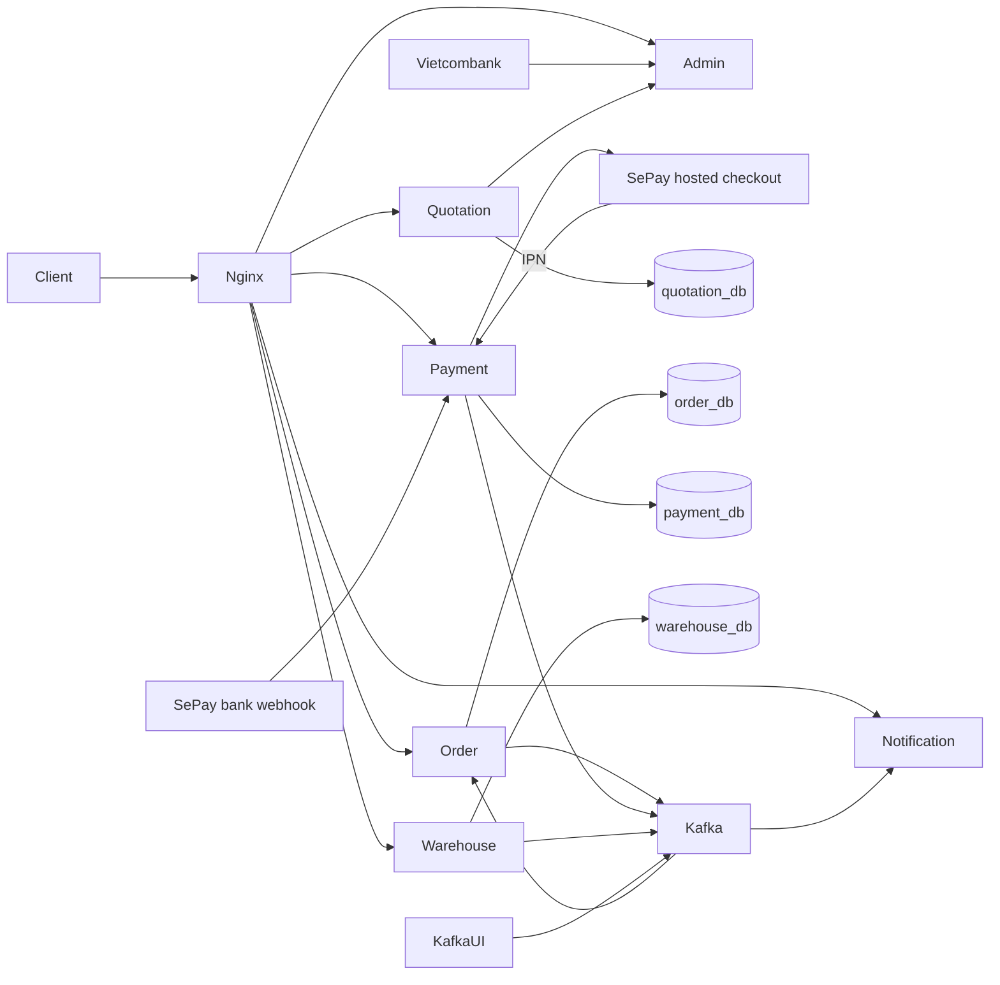
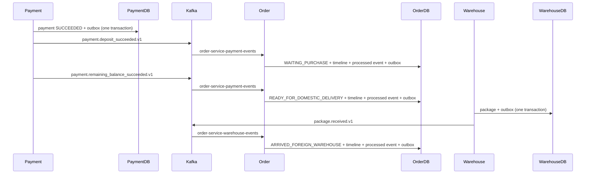

# Architecture

## System context

The broader domain includes Customer, Purchaser, Warehouse Staff, and Admin actors, plus external payment, exchange-rate, and domestic-delivery providers. The implemented sequence covers URL-led quotation extraction, explicit confirmation, 70% deposit and 30% balance payments through mock, direct SePay VietQR, or SePay hosted checkout, provider-verified callbacks, Kafka Order transitions, SSE notifications, warehouse receipt, and read-only Admin rates. Product extraction remains deterministic in demo mode; exchange rates can use either fixed offline values or Vietcombank's public reference feed.

## Container-level architecture



Nginx exposes public REST and SSE APIs. Six Go containers, PostgreSQL, Kafka, Kafka UI, and the one-shot topic initializer share a private Compose network.

## Service responsibilities

- Quotation owns allowlisted extraction, restriction checks, exchange-rate use, fee calculation, expiration, and idempotent Order confirmation.
- Order owns Order state, items, tracking timeline, idempotent consumers, and Order outbox events.
- Payment owns the shared 70% deposit and 30% balance lifecycle, provider selection, direct VietQR requests, hosted-checkout form generation, replay-safe webhook/IPN verification, and the resulting success outbox events.
- Notification consumes Order status events and exposes a bounded-replay SSE stream.
- Warehouse owns foreign-warehouse packages and their receipt outbox event.
- Admin exposes a validated rate snapshot and has no runtime database/Kafka dependency. In `vietcombank` mode it reads selling rates from the official XML feed, rounds them to the nearest VND, and caches the snapshot for at least five minutes. A stale successful snapshot is retained if a later refresh temporarily fails.

## Payment provider modes

The provider adapter changes only how a pending Payment is presented and how
success is authenticated. Persistence and downstream events stay provider
independent.

| Provider | Pending-payment presentation | Trusted completion path |
|---|---|---|
| `mock` | Local demo URL/action | Development-only mock-success request |
| `sepay` | Direct `vietqr.app` image using the configured bank account | HMAC-authenticated incoming-transfer webhook at `/api/v1/payments/sepay/webhook` |
| `sepay_pg` | Same-origin `GET /api/v1/payments/{paymentId}/checkout`, which returns an auto-submitting form for SePay | `X-Secret-Key`-authenticated IPN at `/api/v1/payments/sepay/pg/ipn` |

For `sepay_pg`, `SEPAY_PUBLIC_URL` is the public HTTPS origin used to construct
provider callback URLs. During local Sandbox development it can be a Cloudflare
Quick Tunnel pointing to Nginx on port 80. Production uses the same internal
payment lifecycle with Production merchant credentials and a stable HTTPS
origin; browser return URLs remain informational, while IPN is authoritative.

## Synchronous communication

```text
Order -> Quotation: GET /internal/quotations/{quotationId}, POST /internal/quotations/{quotationId}/confirm
Payment -> Order: GET /internal/orders/{orderId}/payment-summary
Warehouse -> Order: GET /internal/orders/{orderId}/warehouse-summary
Quotation -> Admin: GET /api/v1/admin/rates (private Compose network)
```

These internal endpoints are reachable inside the Docker network and are not routed by Nginx.

## Asynchronous communication



Order also publishes `order.created.v1` and `order.status_changed.v1` from its outbox. Notification consumes status changes; Nginx only routes SSE and never consumes Kafka.

## Data ownership

The single PostgreSQL container hosts `quotation_db`, `order_db`, `payment_db`, `warehouse_db`, and reserved `admin_db`. This is logical database-per-service ownership for a demo: each service receives credentials for and accesses only its own database; cross-service foreign keys do not exist.

## Reliability patterns

- Transactional Outbox avoids losing an event after committing business state.
- Delivery is at least once: publishing can occur again if marking an outbox row published fails.
- Order inserts event IDs in `processed_events` in the same transaction as status/timeline updates.
- Kafka auto-commit is disabled; consumers commit offsets after the database transaction succeeds.
- Transient handler failures retry. Duplicate events return without applying a second state change.
- HTTP servers shut down with a ten-second timeout; Kafka workers/clients and PostgreSQL pools close during coordinated service shutdown.

## Demo deployment

One EC2 instance runs Docker Compose: Nginx, six Go services, one PostgreSQL container, one Kafka broker, and optional demo-only Kafka UI. Only Nginx port 80 should be public. See [EC2 deployment](ec2-deployment.md).

## Target production architecture (future state only)

A production evolution would use a load balancer and TLS, multiple service instances, managed multi-AZ PostgreSQL, a replicated Kafka cluster, secrets management, centralized logs/metrics/traces, object storage, and autoscaling. This repository does not implement or claim those properties.
